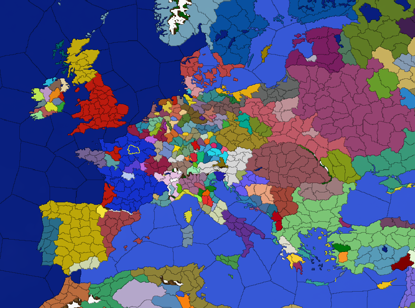

# Grand Strategy Game

## Game Requirements

- Full 2D
- Reliable history realism
- Scalable

## To Do

- Add ImGui for debugging
- Create a basic UI with RmlUI
- Fix frontier initializer bug
- Convert frontier pixels to lines
- Add river layer

## Setup

To run this project you need the original EU4 assets. Copy the following files from your EU4 installation folder into the `assets/` directory:
assets/
├── provinces.bmp
├── terrain.bmp
├── definition.csv
├── 00_countries.txt
├── provinces/
│   └── 1-UppLand.txt
└── countries/
    └── Sweden.txt
