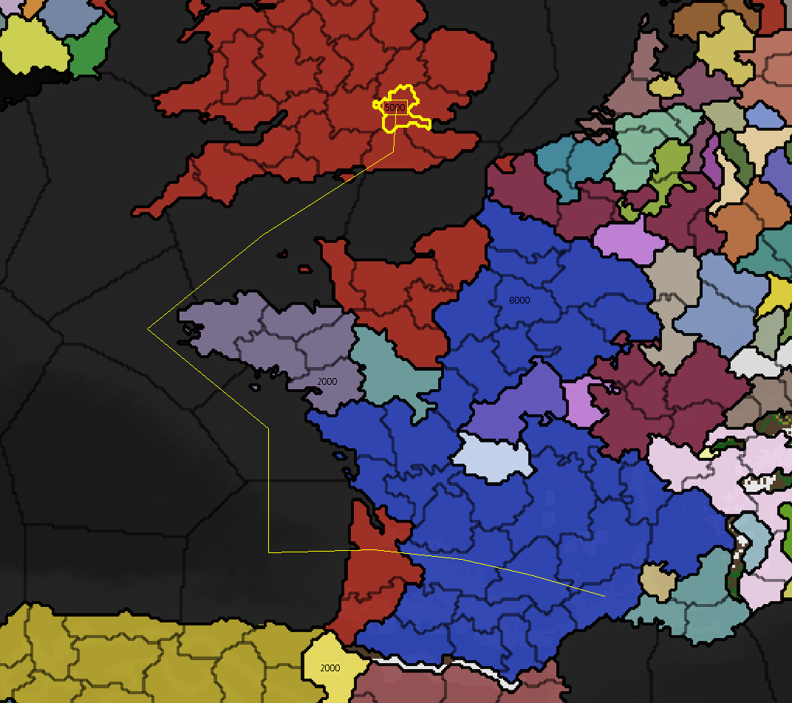

# Grand Strategy Game

This is a fully 2D, real-time grand strategy game inspired by Europa Universalis IV, made in C++ and SDL2 with IMGUI for debuging info, built around the essential pillars of the genre — territorial control, diplomacy, economic management, warfare, and intelligent AI nations — with a lean, reliable, and scalable core that preserves strategic depth without unnecessary complexity.

---

## Architecture

The project follows a strict **MVC (Model-View-Controller)** pattern to keep concerns cleanly separated and the codebase maintainable as it scales.

```
┌───────────────┐     
│  CONTROLLER   │     
│  Event Mgmt   │     
│  Input Handle │     
└───────┬───────┘     
        │             
        ▼             
┌───────────────┐     ┌───────────────┐
│     MODEL     │     │  SIMULATION   │
│  World State  │ <---│ Time Tracking │
│  Game Data    │     │  Game Events  │
└───────┬───────┘     └───────────────┘
        │             
        ▼             
┌───────────────┐     
│     VIEW      │     
│   Renderer    │     
│  Layer System │     
└───────────────┘
```

| Layer | Class | Responsibility |
|-------|-------|----------------|
| **Controller** | `EventManager` | Handles user input and routes it to model mutations |
| **Simulation** | `Simulation` | Mutates the model driven by time and game events |
| **Model** | `World` | Single source of truth — nations, provinces, armies, relations |
| **View** | `Renderer` | Draws all visual layers in order; no game logic |

---

## Screenshots

| | |
|---|---|
|  |  |
|  |  |
|  |  |

---

## Future Vision

The long-term goal is a fully moddable grand strategy game where every system is data-driven.