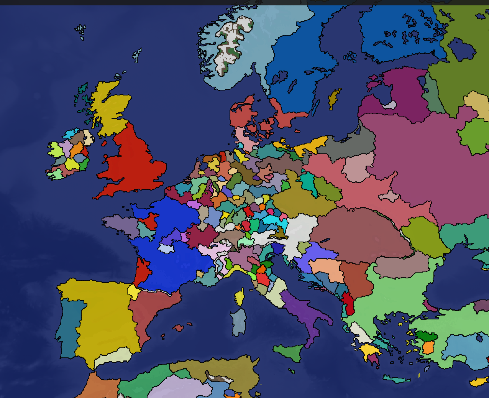
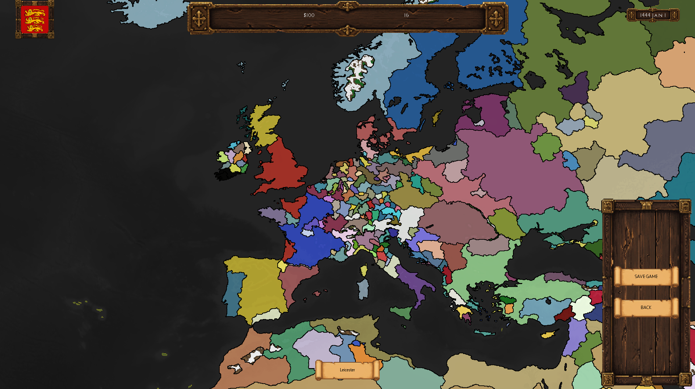
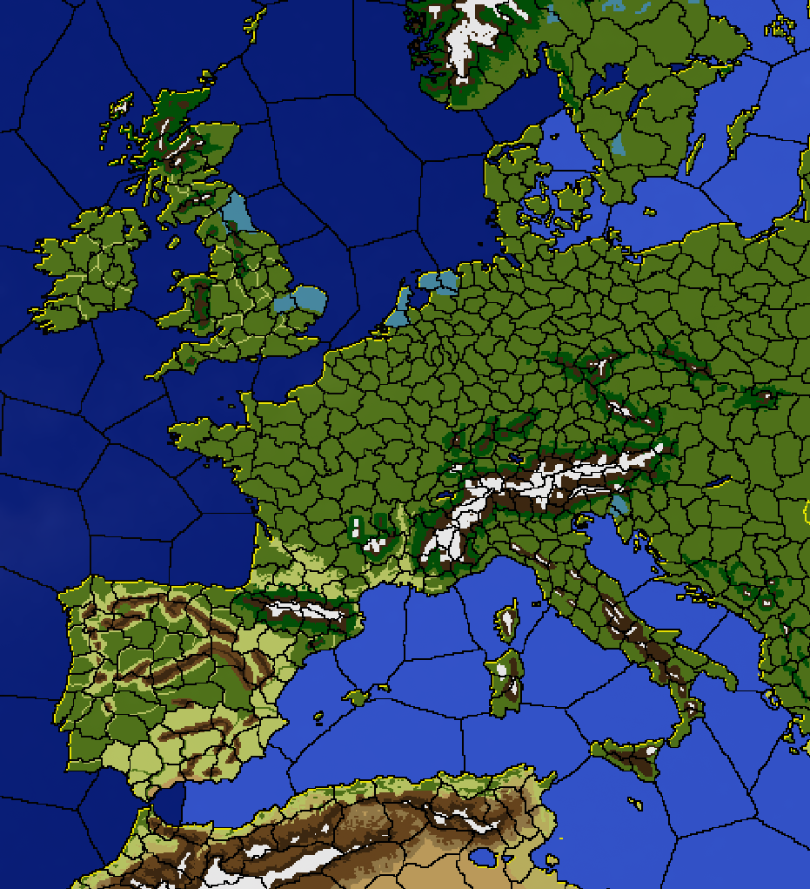
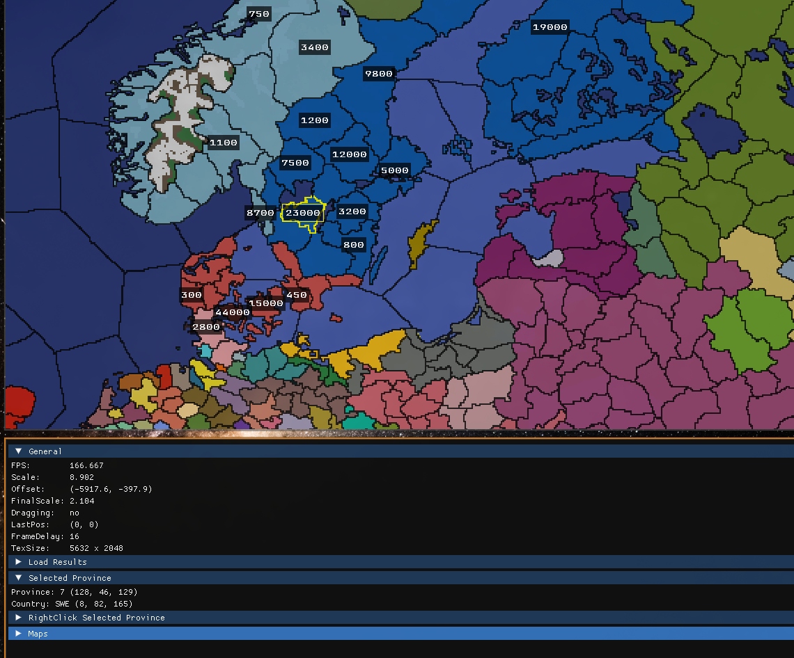

# Grand Strategy Game

> A 2D grand strategy game inspired by the depth of Europa Universalis IV — built from scratch with a focus on performance, scalability, and clean architecture.

---

## Table of Contents

- [Overview](#overview)
- [Architecture](#architecture)
- [Features](#features)
- [Future Vision](#future-vision)
- [Game Images](#game-images)

---

## Overview

**Grand Strategy Game** is a fully 2D, real-time grand strategy game that captures the essential pillars of classical grand strategy titles: territorial control, diplomacy, economic management, warfare, and intelligent AI nations — without the overhead of niche subsystems.

The goal is a **lean, reliable, and scalable core** that covers every major game loop activity, keeping the experience accessible while preserving the strategic depth that defines the genre.

---

## Architecture

The project follows a strict **MVC (Model-View-Controller)** pattern to keep concerns cleanly separated and the codebase maintainable as it scales.

```
┌─────────────────────────────────────────────────┐
│                   CONTROLLER                    │
│         Event Management · Input Handling       │
└────────────────────┬────────────────────────────┘
                     │
        ┌────────────┴────────────┐
        ▼                         ▼
┌───────────────┐        ┌────────────────┐
│     MODEL     │        │      VIEW      │
│  World State  │        │    Renderer    │
│  Game Data    │        │  Layer System  │
└───────────────┘        └────────────────┘
```

| Layer | Class | Responsibility |
|-------|-------|----------------|
| **Model** | `World` | Single source of truth for all game data — nations, provinces, armies, time, relations |
| **View** | `Renderer` | Draws all visual layers in a defined order; contains no game logic |
| **Controller** | `EventManager` | Handles all user input and routes it to the appropriate model mutations |

---

## Features

### Implemented

#### Map System
- Full 2D province map with terrain and height layers
- Country coloring with border rendering
- Province frontiers and country frontier detection
- Multiple map modes (geographic, terrain, relations, etc.)
- Army markers and visual troop indicators

#### Province System
- Province ownership and control
- Development tracking
- Income generation per province

---

### In Development (MVP)

#### Military System
- **Troop movement** — order armies across land and sea
- **Troop limits** — manpower caps based on development and nation size
- **Naval transport** — sea-crossing mechanics for amphibious operations

#### Time Management
- Day-based time progression
- Configurable game speed
- Event scheduling and timed triggers

#### Economy
- Province income calculated per time tick
- Development investment over time
- Treasury management

#### Diplomacy
- War declaration system
- Peace negotiation and agreements
- Alliance formation
- Bilateral relations tracking

#### AI Nations
- War declaration logic (triggers on low relations + shared frontier)
- Peace negotiation (triggers on army attrition/occupation thresholds)
- Alliance logic (triggers on high relations)
- Dynamic relation shifts over time
- AI troop movement toward strategic targets during wartime

---

### Next Version

| Feature | Description |
|---------|-------------|
| **Vector Frontiers** | Convert pixel-based borders to clean vector lines |
| **Aesthetic Pass** | Improved visual design for map, UI, and units |
| **UI Scalability** | Refactor UI components into a modular, resolution-aware system |
| **Live UI Config** | UI layout defined in a config file, hot-reloaded every few frames — enabling real-time UI editing without recompiling |

---

## Known Issues

The rendering pipeline is profiled per layer. Current benchmarks identify two bottlenecks being actively optimized:

### Render Timings (per frame)

| Layer | Time | Status |
|-------|------|--------|
| Map setup | 0.0002 ms | ✅ Fast |
| Height | 0.0019 ms | ✅ Fast |
| Terrain | 0.0006 ms | ✅ Fast |
| Countries | 0.0004 ms | ✅ Fast |
| Country frontiers (pass 1) | 0.00018 ms | ✅ Fast |
| **Province frontiers** | **5.79 ms** | ⚠️ Bottleneck |
| **Country frontiers + marks + armies** | **3.03 ms** | ⚠️ Bottleneck |

---

## Future Vision

The long-term goal is a fully moddable grand strategy engine where every visual and mechanical system is data-driven:

- Province data, nation stats, and event chains defined in editable config files
- UI layouts hot-reloaded from config files (no recompile needed)
- Clean plugin surface for new map modes, AI behaviors, and diplomatic actions
- Vector-quality borders with zoom-level-aware rendering

---

## Game Images

These screenshots were taken from the game and may reflect an older development stage.








*Built with a focus on clean architecture, measurable performance, and strategic depth.*